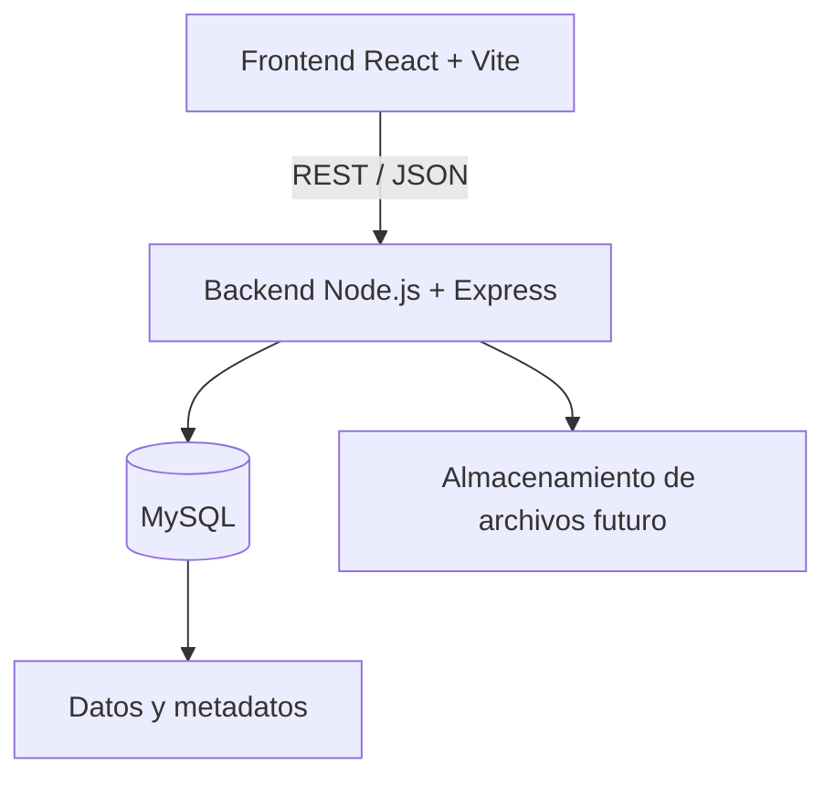

# Sistema Web de Gestión de Préstamos de Equipos Multimedia y Audiovisuales - UAO

Base del proyecto web Full-Stack para organizar el préstamo de cámaras, micrófonos, trípodes, luces y otros recursos de apoyo académico.

## Problema

La información sobre equipos, disponibilidad, solicitudes y archivos de apoyo puede quedar dispersa, lo que dificulta asignar recursos y consultar su historial. El sistema propone centralizarla en una aplicación web.

## Objetivo

Permitir que estudiantes y docentes consulten y soliciten equipos, mientras los encargados administran inventario y préstamos. El desarrollo se realiza por entregas; este repositorio cubre la base técnica y visual del **Avance 1**.

## Alcance

En el Avance 1 se entrega el modelo relacional, el diagrama E/R, frontend y backend separados, `/health` con comprobación real de MySQL, landing y formularios públicos maquetados. El registro, login, rutas privadas, CRUD, préstamos y subida de archivos funcionales pertenecen al Avance 2 y fases posteriores.

## Usuarios

Estudiantes y docentes solicitan equipos. Administradores o encargados mantienen el inventario y revisan solicitudes. Cada cuenta tendrá un rol.

## Historias de usuario principales

- **HU01:** Como estudiante o docente, quiero consultar equipos disponibles para saber qué puedo solicitar.
- **HU02:** Como usuario, quiero registrarme para acceder a la plataforma.
- **HU03:** Como usuario registrado, quiero iniciar sesión para acceder a funciones privadas.
- **HU04:** Como usuario, quiero crear una solicitud con uno o varios equipos para una actividad académica.
- **HU05:** Como administrador, quiero gestionar equipos y disponibilidad para mantener el inventario.
- **HU06:** Como administrador, quiero aprobar o rechazar solicitudes según disponibilidad.
- **HU07:** Como administrador, quiero asociar archivos o manuales a un equipo para facilitar su consulta.

## Stack tecnológico

- Frontend: React, Vite, React Router, JavaScript y CSS.
- Backend: Node.js, Express, `mysql2`, CORS y `dotenv`.
- Base de datos: MySQL 8, conservado del proyecto anterior. No se utiliza ORM.

## Arquitectura



El backend mantiene la conexión y los errores fuera del frontend. `GET /health` ejecuta `SELECT 1` contra MySQL. Los archivos físicos se guardarán en disco o en almacenamiento externo; la tabla `archivo_multimedia` conserva solo sus metadatos. El modelo está en [database/schema.sql](database/schema.sql), el diagrama editable en [docs/Modelo ER.uxf](docs/Modelo%20ER.uxf) y las decisiones de transición en [docs/migracion-desde-escritorio.md](docs/migracion-desde-escritorio.md).

## Estructura del repositorio

```text
frontend/    React, Vite, rutas y estilos
backend/     API Express y conexión MySQL
database/    esquema, catálogos y script de inicialización
docs/        contexto y diagrama E/R
```

El código anterior de Windows Forms se retiró del flujo activo. Sus ideas de entidades y relaciones se utilizaron para diseñar el modelo web; el historial previo de Git conserva el código original.

## Requisitos previos

- Node.js 20.19+ o 22.12+ (24 también funciona) y npm.
- MySQL 8 iniciado, con un usuario que pueda crear bases de datos para la inicialización.

## Instalación

Desde la raíz:

```bash
npm install
```

## Configuración de variables de entorno

Copiar `backend/.env.example` a `backend/.env` y completar `DB_HOST`, `DB_PORT`, `DB_USER`, `DB_PASSWORD`, `DB_NAME`, `PORT` y `FRONTEND_ORIGIN`. Copiar `frontend/.env.example` a `frontend/.env` y ajustar `VITE_API_URL` si el backend usa otra dirección. Estos archivos `.env` están excluidos de Git.

En PowerShell:

```powershell
Copy-Item backend/.env.example backend/.env
Copy-Item frontend/.env.example frontend/.env
```

Los valores de los archivos de ejemplo son de referencia y **no son credenciales reales**. Para crear la base, use un nombre nuevo como `prestamos_uao_web`; no aplique el esquema sobre la base de la aplicación anterior. Si su usuario MySQL no puede crear bases, cree una base vacía manualmente y conceda permisos antes de continuar.

## Creación y configuración de la base de datos

Con MySQL en ejecución y `backend/.env` completo:

```bash
npm run db:init
```

Este comando crea la base indicada por `DB_NAME` si no existe, aplica `database/schema.sql` y carga los catálogos de `database/seed.sql`. Se puede repetir sobre el esquema web; los catálogos usan claves únicas. No crea cuentas ni contraseñas. Si ya existe una base con tablas del modelo antiguo, utilice otra base vacía; la migración de datos históricos requiere un proceso específico y no se hace automáticamente.

## Ejecución del backend

```bash
npm run backend
```

## Ejecución del frontend

En otra terminal:

```bash
npm run frontend
```

También se pueden iniciar ambos con `npm run dev`. Las rutas públicas son `/`, `/login` y `/registro`. Los formularios tienen validación nativa básica, pero no envían datos todavía.

## Prueba de /health

Con backend y MySQL iniciados:

```powershell
Invoke-RestMethod http://localhost:3001/health
```

Debe responder HTTP 200 con `{"status":"ok","database":"connected"}`. Si la base no responde, el endpoint devuelve HTTP 503 y no expone credenciales. El frontend puede consultar este servicio mediante `VITE_API_URL`; la landing muestra su estado.

## Estado actual del proyecto

- [x] Problema, objetivo, alcance e historias documentados.
- [x] Frontend React + Vite y backend Node.js + Express separados.
- [x] Modelo MySQL y E/R con usuarios, roles, préstamos y metadatos de archivos.
- [x] Esquema preparado para `password_hash` y persistencia dual.
- [x] Landing, login y registro maquetados y adaptables.
- [x] API con `/health` que consulta la base de datos.
- [x] Variables de entorno de ejemplo y archivos locales ignorados.
- [ ] Autenticación funcional, rutas privadas y CRUD (Avance 2).
- [ ] Subida de archivos y despliegue (Avance 2 y entrega final).

La verificación local concreta se comunica al finalizar la migración; un entorno nuevo debe repetir instalación, inicialización y prueba de `/health`.

## Próximos pasos: Avance 2

Implementar registro con hashing seguro, login y logout, autorización por rol, rutas privadas, CRUD de inventario y solicitudes, validación transaccional de disponibilidad y subida multipart con metadatos en MySQL. La aplicación completa también deberá almacenar y servir los archivos físicos. GitHub Pages puede alojar más adelante solo el frontend; la API requerirá otro servicio.

## Flujo de trabajo Git

Crear una rama por funcionalidad, registrar cambios con mensajes claros y abrir Pull Requests para revisión antes de integrar. No se presupone que ya existan PRs ni aportes de todos los integrantes; eso deberá reflejar el trabajo real del equipo. No se ha creado un nuevo commit como parte de esta migración.
